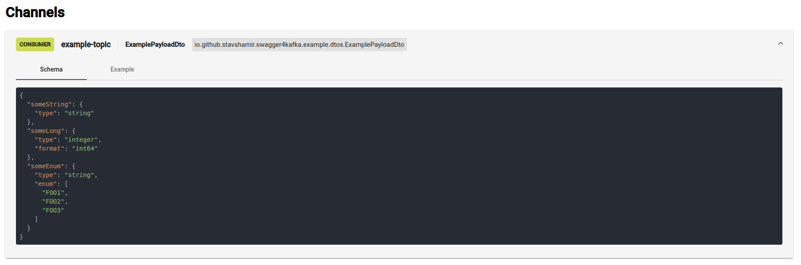

[](https://opensource.org/licenses/Apache-2.0)


# Springwolf (previously swagger4kafka)
##### Automated documentation for async APIs build with Spring Boot



### About
This project is inspired by [Springfox](https://github.com/springfox/springfox), but instead of documenting REST APIs,
it documents async APIs. 

The resulting document is compliant with the [asyncapi specification](https://www.asyncapi.com/) and is provided as a 
web UI, much like that of Springfox, and also allows easy publishing of autogenerated payload examples.

*Currently, only kafka is supported, but support for additional protocols may be added in the future.*

### Why you should use it
In projects using Kafka, you may often find yourself needing to manually send a message to some topic, whether if you
are manually testing a new feature, debugging or trying to understand some flow. This requires:
1. Instantiating a payload object
2. Serializing your payload object 
3. Publishing it by the CLI or some other interface. 

Springwolf exploits the fact you already fully described your consumer endpoint (with ```@KafkaListner``` for example)
and automatically generates an example payload object for the appropriate payload and allows you to publish it to the 
correct topic with a single click.

### Usage
By applying the following instructions, methods annotated with ```@KafkaListener``` inside ```@Component``` and 
```@Service``` annotated classes will be scanned once in runtime. Needless to mention, the project must be a Spring Boot
 project with the ```spring-kafka``` library and its relevant configurations. 

#### Dependencies
springwolf is hosted on jcenter.
##### Gradle
```groovy
repositories {
    jcenter()
}

dependencies {
    // Provides the documentation API    
    implementation 'io.github.stavshamir:springwolf-core:0.0.1'
    
    // Provides the UI - optional (recommended)
    runtimeOnly 'io.github.stavshamir:springwolf-ui:0.0.1'
}
```
##### Maven
```xml
<dependencies>
    <dependency>
      <groupId>io.github.stavshamir</groupId>
      <artifactId>springwolf-core</artifactId>
      <version>0.0.1</version>
    </dependency>
    <dependency>
      <groupId>io.github.stavshamir</groupId>
      <artifactId>springwolf-ui</artifactId>
      <version>0.0.1</version>
    </dependency>
</dependencies>
```

### Integrating Springwolf into a Spring Boot project
Add a configuration class and provide a ```AsyncApiDocket``` bean:
```java
@Configuration
@EnableAsyncApi
public class AsyncApiConfiguration {

    private final String BOOTSTRAP_SERVERS;

    public AsyncApiConfiguration(@Value("${kafka.bootstrap.servers}") String bootstrapServers) {
        this.BOOTSTRAP_SERVERS = bootstrapServers;
    }

    @Bean
    public AsyncApiDocket asyncApiDocket() {
        Info info = Info.builder()
                .version("1.0.0")
                .title("Springwolf example project")
                .build();

        KafkaProtocolConfiguration kafka = KafkaProtocolConfiguration.builder()
                .basePackage("io.github.stavshamir.springwolf.example.consumers")
                .producerConfiguration(buildProducerConfiguration(BOOTSTRAP_SERVERS))
                .build();

        return AsyncApiDocket.builder()
                .info(info)
                .server("kafka", Server.kafka().url(BOOTSTRAP_SERVERS).build())
                .protocols(Protocols.builder().kafka(kafka).build())
                .build();
    }

    private Map<String, Object> buildProducerConfiguration(String bootstrapServers) {
        return ImmutableMap.<String, Object>builder()
                .put(ProducerConfig.BOOTSTRAP_SERVERS_CONFIG, bootstrapServers)
                .put(ProducerConfig.KEY_SERIALIZER_CLASS_CONFIG, StringSerializer.class)
                .put(ProducerConfig.VALUE_SERIALIZER_CLASS_CONFIG, JsonSerializer.class)
                .put(JsonSerializer.ADD_TYPE_INFO_HEADERS, false)
                .build();
    }

}
```
The basePackage field must be set with the name of the package containing the classes to be scanned for ```@KafkaListener```
annotated methods.

#### Verify
If you have included the UI dependency, access it with the following url: ```localhost:8080/asyncapi-ui.html```.
If not, try the following endpoint: ```localhost:8080/asyncapi/docs``.

### Example Project
An example project can be found [here](https://github.com/stavshamir/springwolf/tree/master/springwolf-example).
You can also run the provided [docker-compose](./docker-compose.yml) file and check ```localhost:8080/asyncapi-ui.html```.